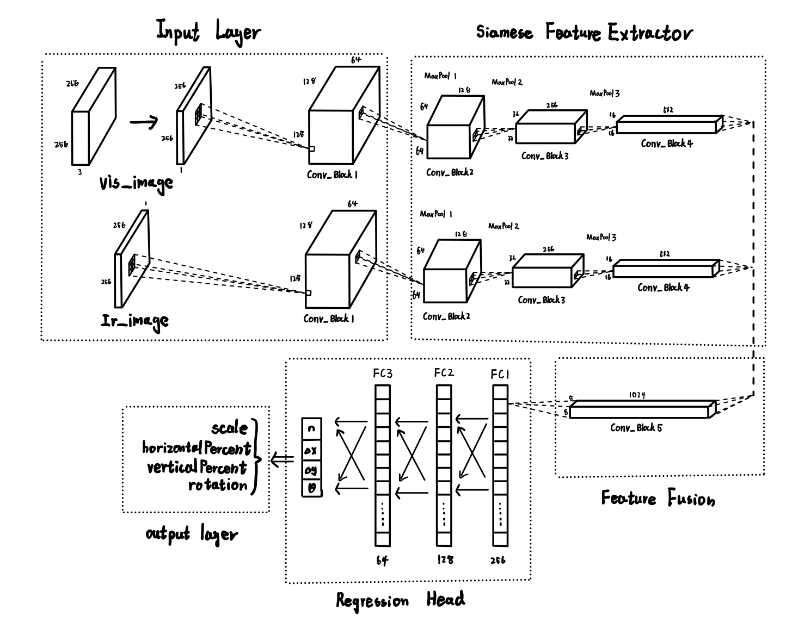

# 端到端多模态图像配准CNN

## 项目简介

本项目为端到端多模态图像配准CNN，实现了一个孪生CNN网络，用于估计两种模态（如红外和可见光）图像之间的四个相似变换参数：旋转角度θ、缩放因子s和平移向量(Δx, Δy)，从而实现对图像进行对齐。

本项目可用于制作像素级对齐的双模态图像对，用于多模态模型训练。

## 模型架构

模型使用权重共享的孪生网络架构，具体结构如图所示：



## 使用方法

### 训练模型

```bash
python train.py --vis_dir PATH_TO_VIS --ir_dir PATH_TO_IR --json_path PATH_TO_JSON --model_dir MODEL_SAVE_DIR
```

主要参数：
- `--vis_dir`: 可见光图像目录
- `--ir_dir`: 红外图像目录
- `--json_path`: 变换参数JSON文件路径
- `--model_dir`: 模型保存目录
- `--train_percentage`: 训练集占比
- `--batch_size`: 批量大小
- `--num_epochs`: 训练轮数
- `--learning_rate`: 学习率
- `--resume`: 从检查点恢复训练（可选）

也可以不指定参数，此时将使用 `parse_args()` 中各参数的默认值。

### 模型推理

```bash
python inference.py --vis_dir PATH_TO_VIS --ir_dir PATH_TO_IR --model_path PATH_TO_MODEL --output_dir OUTPUT_DIR
```

主要参数：
- `--vis_dir`: 可见光图像目录
- `--ir_dir`: 红外图像目录
- `--model_path`: 模型路径
- `--output_dir`: 输出结果目录
- `--image_id`: 指定单张图像ID（不指定则处理所有图像）
- `--fusion_mode`: 融合模式（average, weighted, false_color, layered）

也可以不指定参数，此时将使用 `parse_args()` 中各参数的默认值。

### 推理结果

推理完成后，系统会为每个处理的图像生成以下文件：

1. **原始红外图像**: `ir_original.jpg`
2. **对齐后的红外图像**: `ir_aligned.jpg`
3. **可见光图像**: `vis.jpg`
4. **融合图像**: `fused.jpg`
5. **可视化结果**: `fusion.jpg`（包含所有图像和变换参数的可视化）
6. **参数JSON文件**: `params.json`（包含预测的变换参数和真实参数）

## 贡献者

本项目由以下两位完成：

* [T-Auto](https://github.com/T-Auto)
* [DawnMoon2333](https://github.com/DawnMoon2333/)
